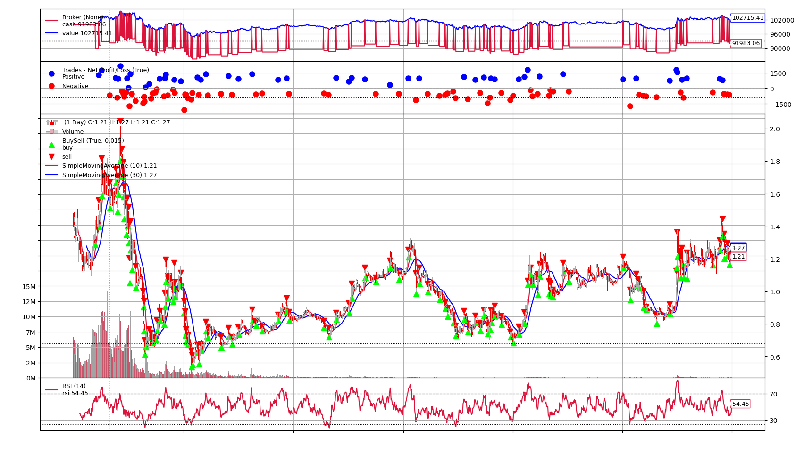
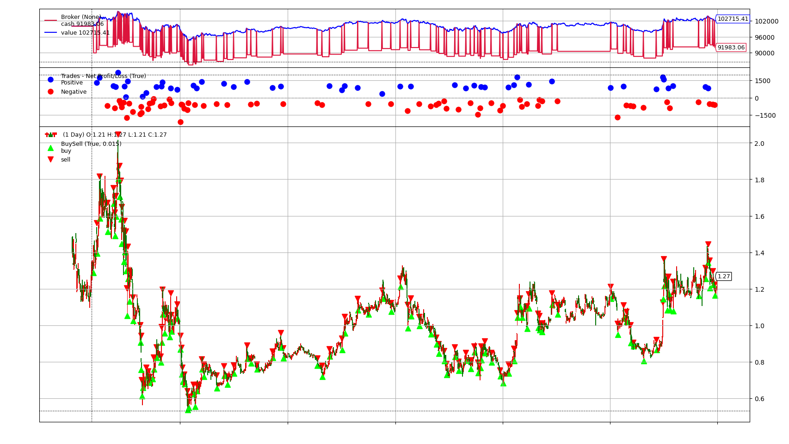

# LSTM-Attention Financial Time Series Forecasting

> Financial Time-Series Prediction using Deep Learning (LSTM + Attention)

---

## Disclaimer | 免责声明

### 中文

本项目仅用于学习、研究和技术交流目的。

本仓库展示了基于 Long Short-Term Memory (LSTM) 网络与 Attention 机制的金融时间序列预测实验，不构成任何形式的投资建议、金融建议、证券分析意见或证券买卖建议。

项目中的预测结果、回测结果及可视化图表仅用于模型研究与实验验证，不能保证未来市场表现或投资收益。

作者不对模型预测准确性、交易收益、风险控制能力或实际投资结果作任何保证。因使用本项目代码、模型或相关内容而产生的任何投资决策、交易行为及相关损失，均由使用者自行承担责任。

本项目不应被视为生产环境下的投资系统或自动交易系统。

使用风险自负。

### English

This project is provided solely for educational, research, and technical demonstration purposes.

The repository demonstrates the application of Long Short-Term Memory (LSTM) networks and Attention mechanisms to financial time-series forecasting and does not constitute financial advice, investment advice, security analysis, or a recommendation to buy or sell any financial instrument.

The forecasting results, backtesting outputs, and visualizations are intended only for research and experimental validation. They should not be interpreted as evidence of future profitability or market performance.

The author makes no guarantees regarding prediction accuracy, profitability, risk management, or future investment outcomes. Users are solely responsible for any decisions, actions, profits, or losses resulting from the use of this repository.

This project should not be considered a production-ready investment or automated trading system.

Use at your own risk.

---

## Overview

This project explores the use of deep learning techniques for financial time-series forecasting.

The model combines Long Short-Term Memory (LSTM) networks with an Attention mechanism to capture both temporal dependencies and important market signals from historical financial data.

The project was developed as a personal research and learning exercise to better understand:

- Time-series forecasting
- Deep learning for sequential data
- LSTM architectures
- Attention mechanisms
- Financial market prediction
- Backtesting and model evaluation

---

## Features

- LSTM-based sequence modeling
- Attention-enhanced forecasting architecture
- Financial feature preprocessing pipeline
- Data normalization and scaling
- Model training and evaluation
- Prediction visualization
- Backtesting support
- Pretrained model checkpoint

---

## Project Structure

```text
lstm_attention/
│
├── LSTM_attention_Model.py      # LSTM + Attention model definition
├── preprocess.py                # Data preprocessing pipeline
├── feature_processor.py         # Feature engineering utilities
├── train.py                     # Model training script
├── test.py                      # Model evaluation script
├── backtrack.py                 # Backtesting and result analysis
│
├── feature_scaler.pkl           # Feature normalization scaler
├── label_scaler.pkl             # Target normalization scaler
├── lstm_etf.pth                 # Trained model checkpoint
│
├── Figure_0.png                 # Prediction / Backtesting result
├── Figure_1.png                 # Prediction / Backtesting result
│
├── 结果记录.txt
└── README.md
```

---

## Model Architecture

The forecasting model consists of:

1. Input financial features
2. LSTM layers for temporal dependency modeling
3. Attention mechanism for feature weighting
4. Fully connected output layer
5. Forecast generation

The Attention module allows the model to focus on more informative historical observations when generating predictions.

---

## Environment

Tested with:

- Python 3.x
- PyTorch
- NumPy
- Pandas
- Scikit-Learn
- Matplotlib
- SciPy

---

## Workflow

```text
Historical Market Data
            │
            ▼
     Data Preprocessing
            │
            ▼
     Feature Engineering
            │
            ▼
      Data Scaling
            │
            ▼
      LSTM + Attention
            │
            ▼
        Prediction
            │
            ▼
       Backtesting
            │
            ▼
      Performance Analysis
```

---

## Experimental Results

### Backtesting Result 1



### Backtesting Result 2



The figures illustrate model predictions, trading signals, portfolio value changes, and backtesting performance generated during the evaluation process.

---

## Model Checkpoint

The repository includes a pretrained model:

```text
lstm_etf.pth
```

The checkpoint can be loaded directly for evaluation and experimentation.

---

## What I Learned

Through this project I explored:

- Financial time-series forecasting
- Deep learning for sequential data
- Long Short-Term Memory (LSTM)
- Attention mechanisms
- Feature engineering
- Data normalization techniques
- Backtesting methodologies
- Model evaluation in financial applications

---

## Limitations

Several limitations should be noted:

- Performance is highly dependent on data quality.
- Historical performance does not imply future performance.
- Financial markets are inherently noisy and non-stationary.
- The model has not been validated for real-world trading deployment.
- Transaction costs, slippage, and liquidity constraints may significantly affect actual results.

---

## Future Work

Potential future improvements include:

- Transformer-based architectures
- Multi-asset forecasting
- Feature selection optimization
- Hyperparameter tuning
- Walk-forward validation
- Risk-adjusted objective functions
- Ensemble forecasting models

---

## Data Availability

The original dataset used in this project is not included in the repository.

Any proprietary, restricted, or non-public data sources have been excluded. The repository only contains the model implementation, trained checkpoint, and experimental results required for reproducibility and demonstration.

---

## License

This project is released under the MIT License.

See the LICENSE file for details.
